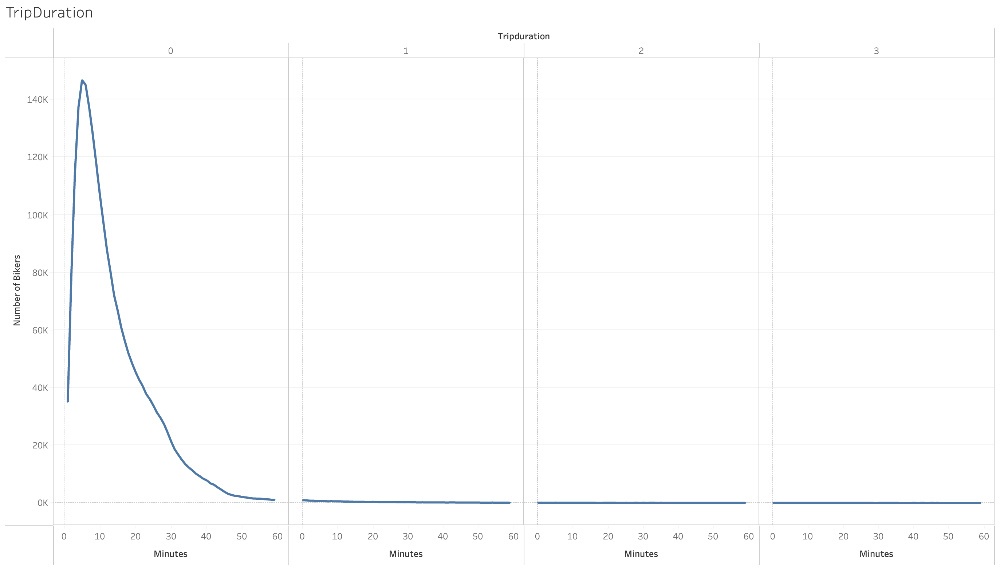
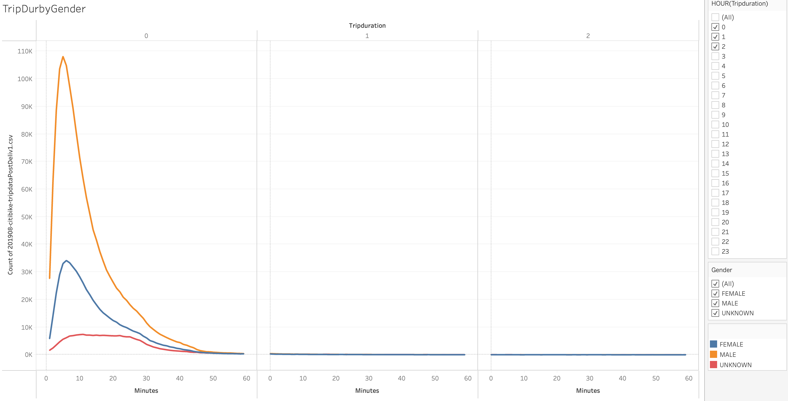
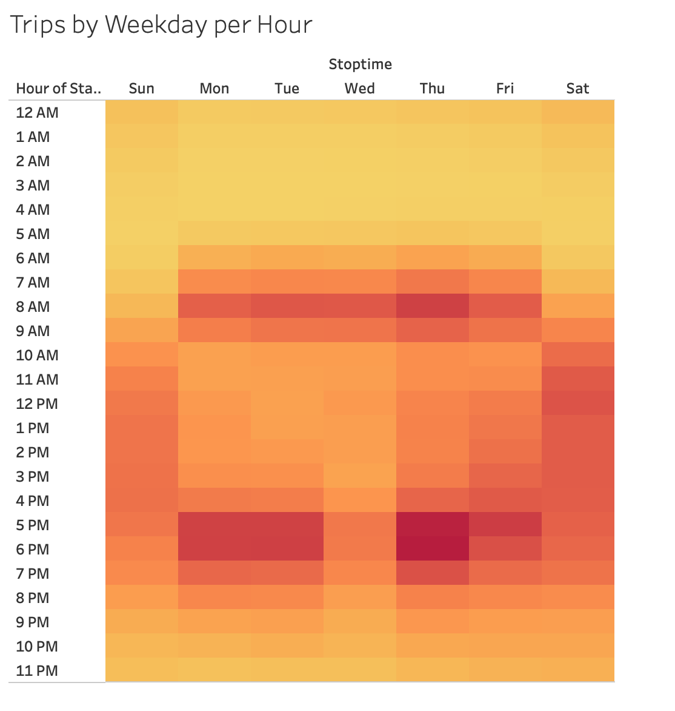
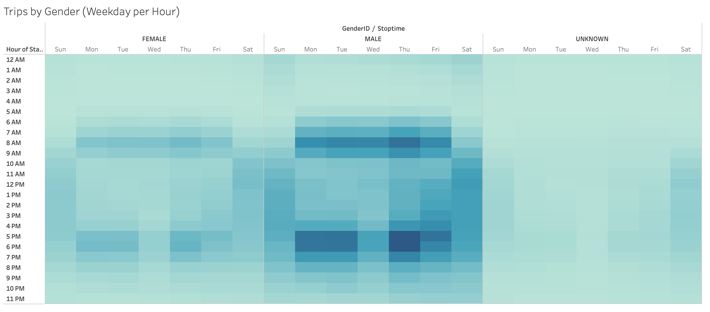
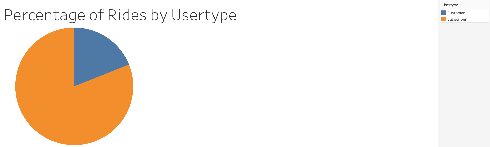
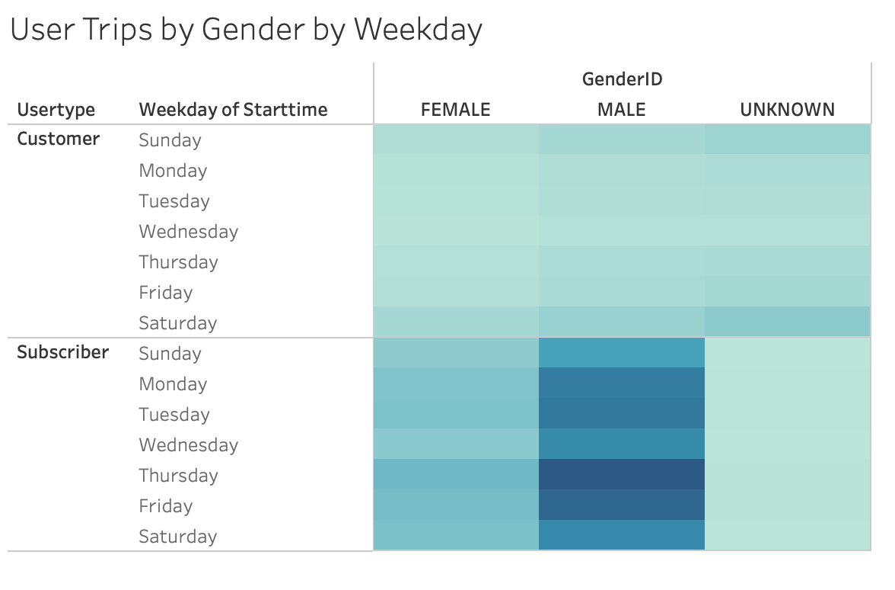

# bikesharing

## Overview
The goal of this analysis was to begin taking a look at data from August 2018 for a ride/bike sharing app in New York City to help show the popularity of these types of apps to reinforce they could be used elsewhere.  This was done using a combination of Python and Tableau to clean our dataset and create a visual story.  To view this public tableau story, please follow the link below.

[link to dashboard](https://public.tableau.com/app/profile/patrick.gilchrist/viz/Mod15Challenge2/UsagebyGenderandUsertype?publish=yes)

The images found below in this file can also be found in the link above and are more interactive.

## Results

Below is screenshot showing the total number of riders by trip duration for the month of August, 2018.  The time with the most riders was 5 minutes with significant drop off on either side.

Our second visual is an introduction to the breakdown of riders by gender, a variable which will be incorporated into most of the remaining visuals.  We can see that men make up almost 2/3 of our riders.

Here we are incorporting gender into our trip duration graph.  This sees to indicate that men and women ride for about the same amount of time with the peak for men being 5 minutes and for women it is 6 minutes.

This visual is a heatmap showing the day of the week and what hour that most rides occur with the "hottest" times being Thursday before and after normal business hours.  But in general most commute times are warmer, along with all day on the weekends.

In this next visual we are simply splitting by gender which seems to show similar patterns between men and women.

One other variable we are considering is our usertype of which their are two.  Subscribers which are members on the app, and Customers who pay full price per ride.  Over 80% of the riders are Subscribers.

Adding in this new variable for our last visual, we see that subscribers tend to favor the weekdays while the Customers seem to be slightly more likely to use the ridesharing service on Saturdays.

## Summary
In general, most of the rides for August 2018 in NYC were taken on weekdays as apart of a daily commute and in general these riders were Subscribers and men.  There doesn't appear to be significant difference between men and women in their patterns, however there is a slight difference in pattern when comparing the habits of Subscribers and Customers.  Where those people paying for the subscription heavily favored using these vehicles for their commute, Customers were slightly more likely to use them on the weekends and in particular on Saturdays.  Indicating that those who subscribe to this service would be the regular form of income and would take advantage of the app in their daily needs, meanwhile non-subscribers seem to use the app for more social events that might take place on the weekends.

Two more visualizations I would be curious to see would be to modify our final visual to include the time of day as well to see if perhaps Customers have a time of day on Saturdays that they usually ride.

Second, I think it would be interesting looking at downtime per bike with intent to understand how many bikes would be needed to serve a given population.
